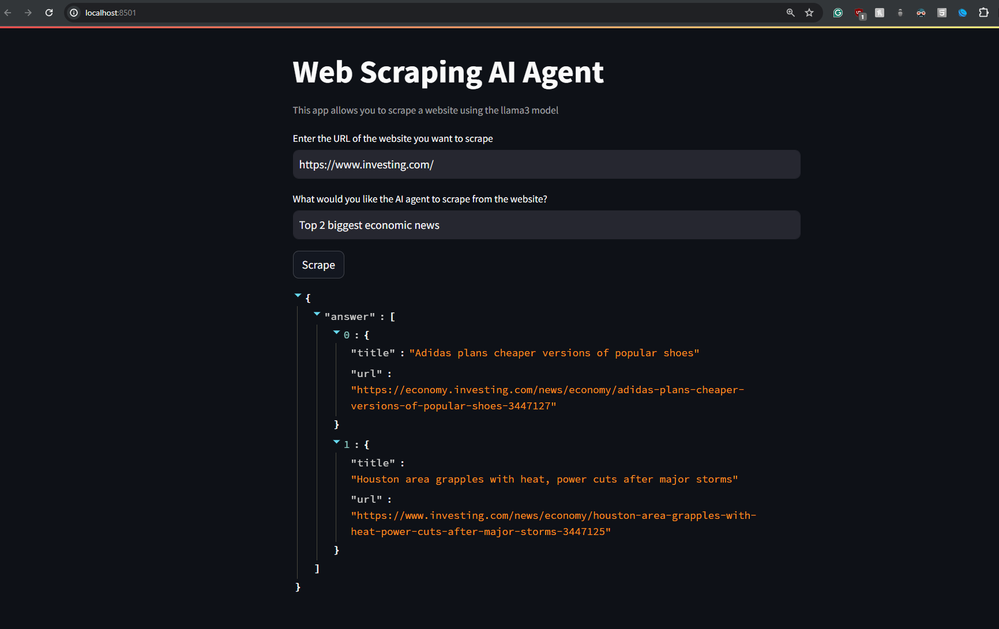

# App Description

This is a web scraping AI agent that uses Llama-3 model running locally on your computer

### Features
- Input a webpage URL
- Ask what you want to filter from the webpage
- Get json formatted answer using RAG and the Llama-3 model running locally on your computer

### Steps to Run

1. Download Ollama from [here](https://ollama.com/download/)

2. Install scrapegraphai (Facilitates the creation of intelligent web scraping workflows using advanced AI/embedding models)
    ```
    pip install scrapegraphai
    ```

3. Install streamlit (Used to build web app)
    ```
    pip install streamlit
    ```

4. Install playwright (Used to launch browsers, navigate to URLs, and interact with web elements.)
    ```
    playwright install
    ```

5. Install llama3 model locally
    ```
    ollama pull llama3
    ```
6. Install embedding model locally
    ```
    ollama pull nomic-embed-text
    ```

7. Check Ollama is running on localhost port: `11434`

8. Start the app
    ```
    streamlit run ai_scrapper_local.py
    ```

### App Preview

